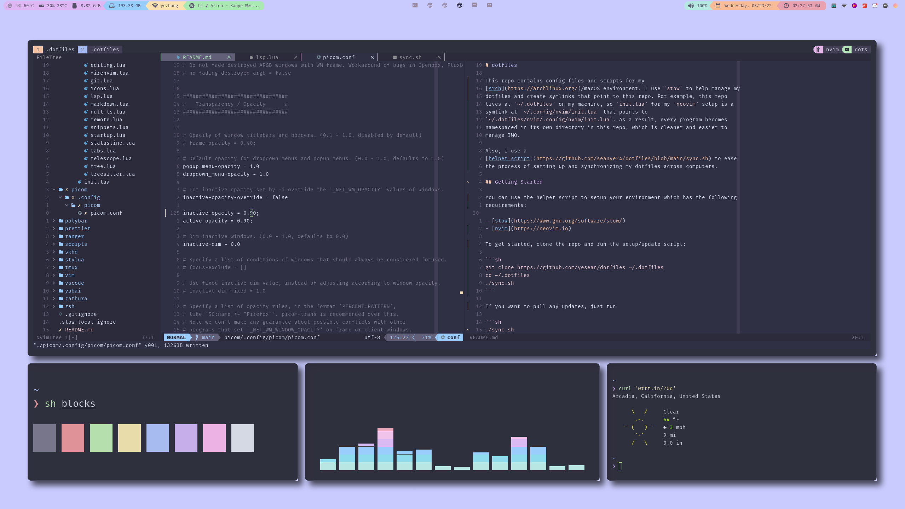

# dotfiles



This repo contains config files and scripts for my
[Arch Linux](https://archlinux.org/)/macOS environment. I use `stow` to help
manage my dotfiles and create symlinks that point to this repo. For example,
this repo lives at `~/.dotfiles` on my machine, so the `init.lua` for my neovim
setup is a symlink at `~/.config/nvim/init.lua` that points to
`~/.dotfiles/nvim/.config/nvim/init.lua`. As a result, every program becomes
namespaced in its own directory in this repo, which is cleaner and easier to
manage IMO.

## Installation

There is a
[helper script](https://github.com/seanye24/dotfiles/blob/main/sync.sh) for easy
setup, with the following requirements:

- [stow](https://www.gnu.org/software/stow/)
- [nvim](https://neovim.io)

To get started, clone the repo and run the helper script:

```sh
git clone https://github.com/yesean/dotfiles ~/.dotfiles
cd ~/.dotfiles
./sync.sh
```

If you just want to pull updates, run

```sh
./sync.sh
```

by itself.

> If `sync.sh` fails, it's likely because you are either missing a dependency or
> one of the config files is conflicting with an existing file on your system.
> For instance, if you already a neovim config at `~/.config/nvim/init.lua`,
> `stow` won't be able to create a symlink at `~/.config/nvim/init.lua` that
> points to this repo's config at `~/.dotfiles/nvim/.config/nvim/init.lua`. You
> either have to delete/backup your `init.lua` or remove `nvim` from the
> programs array in `sync.sh`.

### Manual

_Alternatively_, just copy and paste whatever you want! My dotfiles are specific
to my preferences and use cases which are probably different from yours.

## Why This Exists

I found it tedious manually synchronizing config file changes between my desktop
and laptop, so I began looking for a simple, centralized solution that quickly
pulled any changes to my configs. After some researching and experimenting, this
repo was born. Moreover, I've found lots of inspiration from other people's
dotfiles so enjoy!

## Things I Use

| program                                                                   | purpose             | os     |
| ------------------------------------------------------------------------- | ------------------- | ------ |
| [alacritty](https://alacritty.org/)                                       | terminal            | both   |
| [dunst](https://dunst-project.org/)                                       | notifications       | linux  |
| [git](https://git-scm.com/)                                               | vcs                 | both   |
| [i3](https://i3wm.org/)                                                   | wm                  | linux  |
| [nvim](https://neovim.io/)                                                | code editor         | both   |
| [picom](https://github.com/yshui/picom)                                   | compositor          | linux  |
| [polybar](https://polybar.github.io/)                                     | statusbar           | linux  |
| [prettier](https://prettier.io/)                                          | code formatter      | both   |
| [ranger](https://github.com/ranger/ranger)                                | file manager        | both\* |
| [scripts](https://github.com/seanye24/dotfiles/blob/main/scripts/scripts) | random stuff        | both   |
| [skhd](https://github.com/koekeishiya/skhd)                               | macos hotkey daemon | mac    |
| [stylua](https://github.com/JohnnyMorganz/StyLua)                         | code formatter      | both   |
| [tmux](https://github.com/tmux/tmux/wiki)                                 | terminal wm         | both   |
| [vim](https://www.vim.org/)                                               | code editor         | both   |
| [vscode](https://code.visualstudio.com/)                                  | code editor         | both   |
| [yabai](https://github.com/koekeishiya/yabai)                             | wm                  | mac    |
| [zathura](https://pwmt.org/projects/zathura/)                             | pdf viewer          | both\* |
| [zsh](https://www.zsh.org/)                                               | shell               | both   |

> \* technically both, but much better on linux
