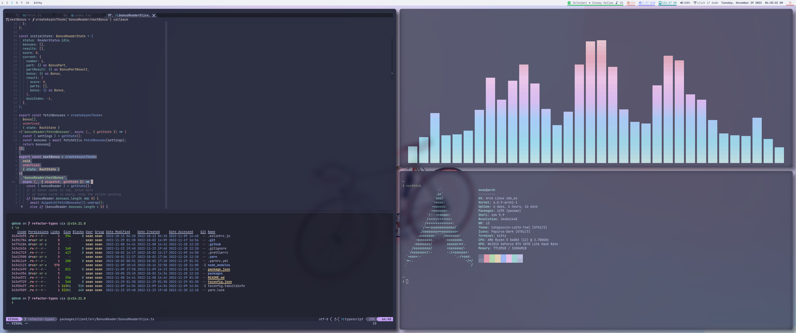

# dotfiles



- config files and scripts for Linux / macOS
- `stow` for namespacing and symlink management, e.g. `~/.zsh` points to
  `~/.dotfiles/zsh/.zshrc`

## Usage

To install:

```sh
git clone https://github.com/yesean/dotfiles ~/.dotfiles
cd ~/.dotfiles
./install.sh
```

> `install.sh` requires a system package manager (macOS →
> [`brew`](https://brew.sh/), Arch Linux →
> [`paru`](https://github.com/Morganamilo/paru) ).

The install script will bootstrap my dotfiles, installing necessary software,
creating symlinks, etc.

To update:

```sh
./update.sh
```

This update script will add new symlinks and update neovim stuff (neovim
upstream, plugins, treesitter parsers).

Install script only needs to be run once, but update script should be run
periodically. I try to update every couple days or when I haven't updated in a
while.

> These scripts only work on macOS and Arch Linux, as I use them daily and can
> test them out. The scripts will probably work for other Linux distros, but you
> have to edit the package manager and package names.

Or, just copy and paste a snippet or a function that looks cool! Most of this
stuff is specific to my needs, so just use whatever **_you_** need.

## Motivation

It was tedious manually syncing config file changes between my desktop and
laptop, so I began looking for a solution that could track changes and update
all my machines at once. I've found lots of inspiration from other people's
dotfiles, so enjoy!

## Highlights

- editor: `nvim`
- terminal: `kitty`
- shell: `zsh`
- wm: `i3-gaps`
- compositor: `picom` (jonaburg fork)
- bar: `polybar`
